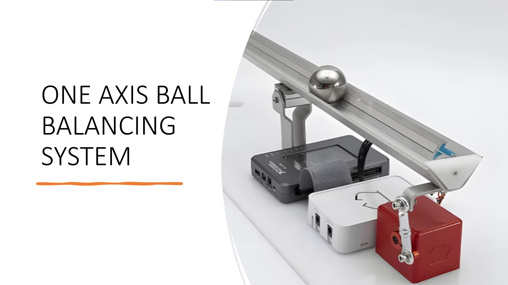
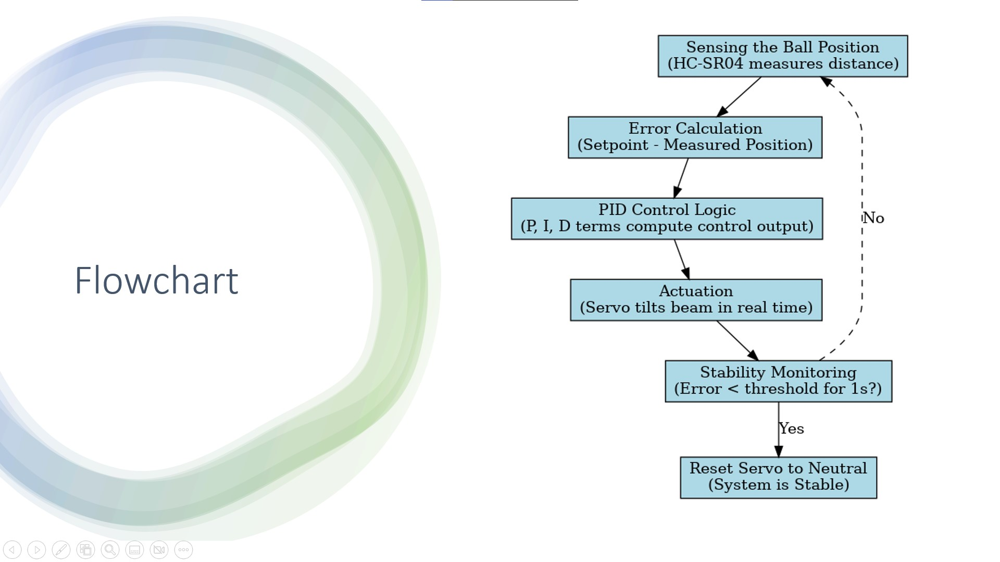

# PID-Controlled One-Axis Ball Balancing System


PID-based one-axis ball balancing robot using Arduino. Uses an ultrasonic sensor and servo motor to stabilize a ball at a target distance. Real-time tuning of Kp, Ki, Kd via Serial. Includes stability detection and automatic neutral reset. The system stabilizes within 30s using empirically tuned parameters.

---

## Project Overview


---

## Final Project Hardware


---

## Features

- **PID Control** for dynamic stability.
- **Real-time sensor feedback** using IR or ultrasonic sensors.
- **Servo motor-driven beam** for accurate actuation.
- **Low-cost microcontroller** implementation (Arduino/STM32).
- **Serial Monitor & LCD** integration for live debugging.
---

## 🛠️ System Architecture


---

## Demo

[Watch the demo video](Demo%20Video.mp4)

---
## Cicuit Diagram

 

---

## Project Summary

This Arduino-based system controls the position of a ball on a beam using **PID control** and real-time feedback from an ultrasonic sensor. The ball is returned to a setpoint by tilting the beam via a servo motor, compensating for positional error.

---

## How It Works

1. **Sensing**: Ball position is measured using HC-SR04.
2. **Filtering**: Distance values are filtered (moving average).
3. **Error Calculation**: `error = distance - setpoint`
4. **PID Control**:
   - **P**: Immediate reaction to error
   - **I**: Compensates for past errors
   - **D**: Predicts upcoming trends
5. **Servo Adjustment**: Beam angle is changed proportionally to the PID output.
6. **Stability Monitoring**: If error stays < 3 cm for 2.5 seconds, servo resets to neutral.

---

## Control Strategy
Implemented a classic PID (Proportional-Integral-Derivative) loop:
Error = Desired Position - Actual Position

PID Output = Kp * Error + Ki * ∫Error + Kd * (dError/dt)
Kp = 5, Ki = 0.01, Kd = 9

Tuned manually and iteratively for minimal overshoot and fast response.

```cpp
error = distance - setpoint;
integral += error;
derivative = error - previous_error;
output = -(Kp * error + Ki * integral + Kd * derivative);
servoAngle = constrain(neutralAngle + output * 1.2, 0, 180);
myServo.write(servoAngle);
```

PID gains can be tuned in real-time via Serial commands.
System resets if ball goes out of range or stabilizes.
Neutral angle adjustment keeps the beam level


## PID Tuning via Serial Monitor
Example commands for real-time tuning:

Kp 5         → Set proportional gain  
Ki 0.01      → Set integral gain  
Kd 9         → Set derivative gain  
neutral 34   → Set neutral servo angle  
servo -20    → Move servo from neutral


## Hardware Components

The following components were chosen for their cost-effectiveness, accuracy, and ease of integration:

| Component            | Description                                                             |
| -------------------- | ----------------------------------------------------------------------- |
| **Beam**             | 30–50 cm acrylic/wood beam, pivot-mounted                               |
| **Ball**             | Lightweight ping-pong ball                                              |
| **Servo Motor**      | SG90 (light load) or MG996R (high torque)                               |
| **Position Sensor**  | - IR (GP2Y0A21) for analog<br>- Ultrasonic (HC-SR04) for digital timing |
| **Microcontroller**  | - Arduino Uno (simple)<br>- STM32 Blue Pill (faster)                    |
| **Power Supply**     | 5V via USB or external battery pack                                     |
| **Optional Display** | 16x2 I2C LCD (PID values, position, error)                              |
| **Accessories**      | Breadboard, jumpers, brackets, bearings, screws, etc.                   |


## Repository Contents

PID-Controlled-One-Axis-Ball-Balancing-System.ino – Core Arduino code

Project_Proposal.pdf – Initial planning

Project_Presentation.pptx – Final presentation

Project_Report.pdf – Detailed documentation

Demo Video.mp4 – Final working demo

Circuit Diagram.jpg – Full wiring reference

Project Picture.jpg – Real setup snapshot

## Tech Stack

Arduino Uno

HC-SR04 Ultrasonic Sensor

SG90 Servo Motor

Serial Monitor for tuning

PID algorithm (manual tuning)

## Results
The system achieved stable control within 30 seconds of a disturbance.
Final PID gains: Kp = 5, Ki = 0.01, Kd = 9
Stability monitoring ensures no unnecessary servo actuation.

## Future Enhancements
2-axis (X-Y) platform.

Vision-based tracking using OpenCV or infrared grids.

Self-tuning adaptive PID or machine learning-based control.

Wireless monitoring via Bluetooth/Wi-Fi.

Simulation-first development using MATLAB or Python.

## Authors

This project was created at **National University of Sciences & Technology (NUST)** as part of the **Linear Control Systems** course project by:


1. Awais Asghar  
2. Muhammad Ashar Javid  
3. Ameer Hamza  
4. Muhammad Hammad Sarwar  

---

## License
This project is licensed under the MIT License.

## References
Åström & Hägglund, Advanced PID Control, ISA.

Ogata, Modern Control Engineering, Pearson.

Arduino PID Library: PID Playground

MATLAB Control Toolbox: MathWorks Control Help!

